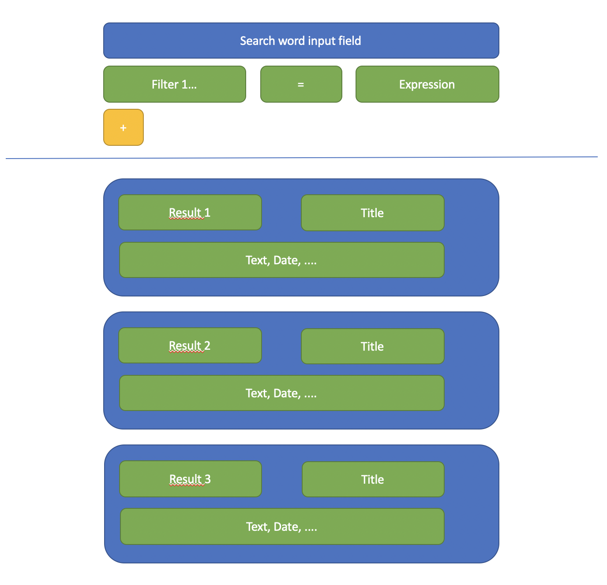

## Findbuch design specification - Work in progress!!!

The first task is the creation of a search GUI, which should be includable with the root angular component of a module. This root angular component should have an input that configures which filters can be added by the user.

More details (that have to be documented as an enhancement issue):

- If nothing is entered in the search input field, the first 25 results can be seen
- if the user scrolls down to the 25th result, the next 25 results are loaded
- Die Einträge sind nach Lemma sortiert, also nach dem Titel des Textkonzepts.
- Das Suchformular erlaubt eine Einschränkung der angezeigten Datensätze, sowie eine alternative Sortierung
- Es können weitere Filterzeilen eingefügt werden. Mehrere Kriterien werden immer mit UND kombiniert.
- Es ist zu berücksichtigen, dass in einer späteren Phase weitere Suchkriterien dazukommen könnten. (z.B. Datierung der Manuskripte, Stadt/Land des Erstdrucks oder des Aufbewahrungsortes)
- Neben den Filterkriterien erlaubt das Suchformular die Auswahl der Sortierung. Es sind folgende Sortierungen möglich:
	- Nach Lemma
	- Dach Erstdruckdatum
- The result component should be configurable via an input as well, which defines which fields should be displayd in the results.
